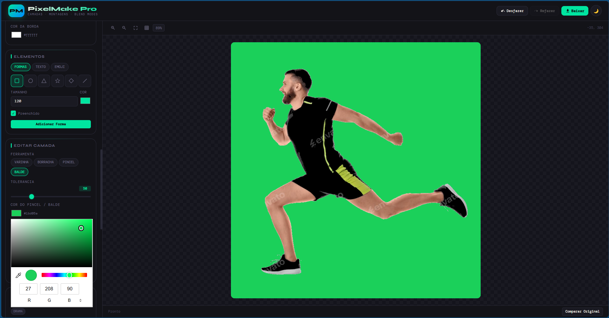
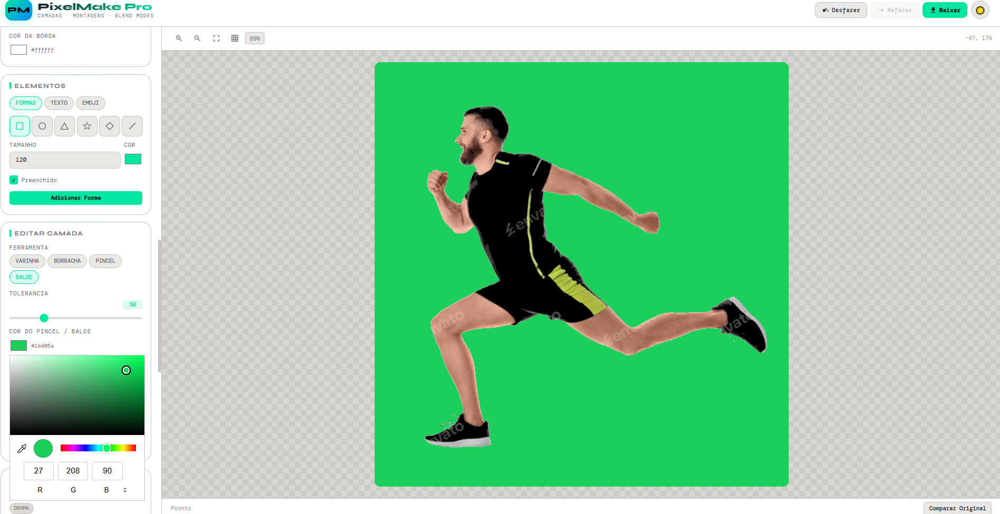
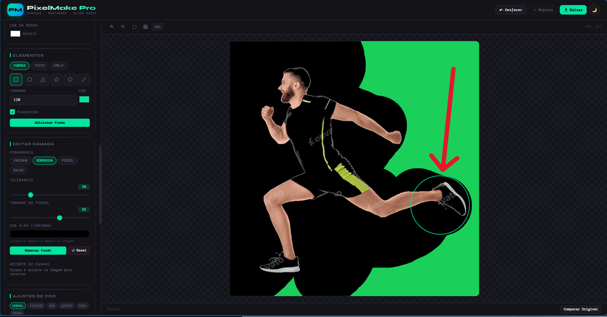

# 🎨 PixelMake Pro

### Editor de Imagens Profissional com Camadas e Montagens

Editor de imagens completo que roda direto no navegador.  
Sem instalação. Sem servidor. Sem limites.

---

## 📸 Preview do Projeto

### 🖼️ Editor Principal
   

### 🧱 Sistema de Camadas

### 🎛️ Ajustes e Efeitos

---

## ✂️ Remoção de Fundo (Exemplo)

| Antes | Depois |
|------|--------|
|  |  |

---

## 📌 Sobre o Projeto

O **PixelForge Pro** é um editor de imagens profissional que funciona inteiramente no navegador.  
Ele permite criar montagens com múltiplas imagens, aplicar efeitos, remover fundos, adicionar textos, formas e muito mais — tudo de graça e sem precisar instalar nada.

---

## ✨ Funcionalidades

### 🧱 Camadas Avançadas
- Múltiplas imagens no mesmo projeto  
- Camadas independentes  
- 16 modos de mistura  
- Opacidade, visibilidade e ordenação  
- Sombra e borda configuráveis  
- Alinhamento automático  
- Duplicar, mesclar, rotacionar e espelhar  

---

### 🛠️ Ferramentas
- Varinha Mágica  
- Borracha Mágica  
- Pincel de Pintura  
- Balde de Tinta  
- Remoção de Fundo  
- Recorte com preview  

---

### 🎛️ Ajustes de Imagem
- Brilho  
- Contraste  
- Saturação  
- Matiz  
- Temperatura  
- Vinheta  
- Desfoque  

**Presets incluídos:**
- Normal  
- Vintage  
- Preto e Branco  
- Quente  
- Frio  
- Dramático  

---

### 🔷 Elementos
- Formas geométricas  
- Texto personalizável  
- Emojis como camadas  
- Totalmente editáveis  

---

### 🖼️ Canvas
- Tamanho personalizado  
- Presets prontos  
- Fundo sólido, transparente ou gradiente  
- Grade de alinhamento  

---

### 🎨 Tema
- Dark / Light  

---

### 📤 Exportação
- PNG (transparência)  
- JPEG (qualidade ajustável)  
- WEBP (qualidade ajustável)  

---

### 🕘 Histórico
- Desfazer e refazer ilimitados  
- Navegação entre estados  

---

## ⌨️ Atalhos

| Atalho | Ação |
|--------|------|
| Ctrl + Z | Desfazer |
| Ctrl + Y | Refazer |
| Ctrl + S | Exportar |
| Delete | Excluir camada |
| Escape | Cancelar recorte |
| Enter | Aplicar recorte |
| Setas | Mover (1px) |
| Shift + Setas | Mover (10px) |
| 1 a 9 | Modos de mistura |

---

## 🚀 Como Usar

### 📦 Download
1. Baixe o projeto  
2. Extraia os arquivos  
3. Abra `index.html` no navegador  

---

### 💻 Clone

git clone pixlMake-pro
cd pixelMake-pro

